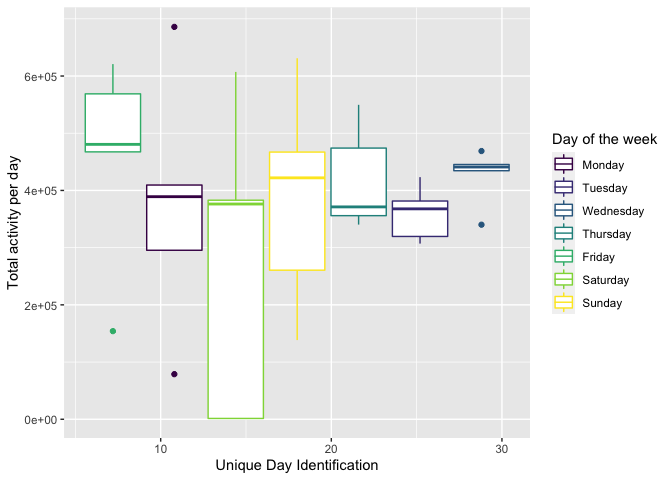

p8105\_hw3\_jdr2191
================
Jess Rosenberg

``` r
library(tidyverse)
```

    ## ── Attaching packages ─────────────────────────────────────── tidyverse 1.3.1 ──

    ## ✓ ggplot2 3.3.5     ✓ purrr   0.3.4
    ## ✓ tibble  3.1.4     ✓ dplyr   1.0.7
    ## ✓ tidyr   1.1.3     ✓ stringr 1.4.0
    ## ✓ readr   2.0.1     ✓ forcats 0.5.1

    ## ── Conflicts ────────────────────────────────────────── tidyverse_conflicts() ──
    ## x dplyr::filter() masks stats::filter()
    ## x dplyr::lag()    masks stats::lag()

``` r
library(p8105.datasets)
data("instacart")
```

``` r
instacart %>%
  sample_n(500) %>%
  ggplot(aes(x = order_hour_of_day, y = order_dow)) + geom_point()
```

<!-- -->

There are 1384617 observations and 15 variables in the instacart
dataset. Each row in the dataset represents an item ordered by a
particular customer.

### How many aisles are there, and which aisles are the most items ordered from?

``` r
instacart %>%
  group_by(aisle_id, aisle) %>%
  summarize(item_sum = sum(product_id)) %>%
  arrange(desc(item_sum))
```

    ## `summarise()` has grouped output by 'aisle_id'. You can override using the `.groups` argument.

    ## # A tibble: 134 × 3
    ## # Groups:   aisle_id [134]
    ##    aisle_id aisle                           item_sum
    ##       <int> <chr>                              <dbl>
    ##  1       24 fresh fruits                  4119439266
    ##  2       83 fresh vegetables              4007541101
    ##  3      123 packaged vegetables fruits    2167743474
    ##  4      120 yogurt                        1468727336
    ##  5       21 packaged cheese               1003832255
    ##  6      115 water seltzer sparkling water  963861086
    ##  7      107 chips pretzels                 807454481
    ##  8       84 milk                           738884407
    ##  9       91 soy lactosefree                679679179
    ## 10       31 refrigerated                   595356295
    ## # … with 124 more rows

There are aisles. The top four aisles for the most items ordered from
are fresh fruits, fresh vegetables, packaged vegetables fruits, and
yogurt.
