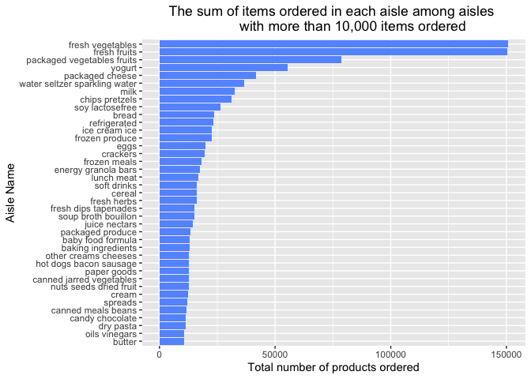

p8105\_hw3\_jdr2191
================
Jess Rosenberg

``` r
library(tidyverse)
```

    ## ── Attaching packages ─────────────────────────────────────── tidyverse 1.3.1 ──

    ## ✓ ggplot2 3.3.5     ✓ purrr   0.3.4
    ## ✓ tibble  3.1.4     ✓ dplyr   1.0.7
    ## ✓ tidyr   1.1.3     ✓ stringr 1.4.0
    ## ✓ readr   2.0.1     ✓ forcats 0.5.1

    ## ── Conflicts ────────────────────────────────────────── tidyverse_conflicts() ──
    ## x dplyr::filter() masks stats::filter()
    ## x dplyr::lag()    masks stats::lag()

``` r
library(p8105.datasets)
library(lubridate)
```

    ## 
    ## Attaching package: 'lubridate'

    ## The following objects are masked from 'package:base':
    ## 
    ##     date, intersect, setdiff, union

``` r
library(viridis)
```

    ## Loading required package: viridisLite

``` r
options(
  ggplot2.continuous.colour = "viridis",
  ggplot2.continuous.fill = "viridis"
)

scale_colour_discrete = scale_colour_viridis_d 
scale_fill_discrete = scale_fill_viridis_d
```

# Problem 1

``` r
data("instacart")

instacartreorders_df = instacart %>%
  mutate(dow = factor(order_dow, ordered = TRUE, levels = c(0,1,2,3,4,5,6))) %>%
  mutate(order_dow2 = order_dow + 1) %>%
  mutate(day_of_week = wday(order_dow2, label = TRUE)) %>%
  mutate(reorder2 = ifelse(reordered %in% c(0), "No", "Yes") %>%
           factor(levels = c("No","Yes")))

instacartreorders_df %>%
  sample_n(500) %>%
  ggplot(aes(x = order_hour_of_day, fill = reorder2)) +
  geom_density(aes(fill = reorder2), alpha = .5) +
  facet_grid(rows = vars(day_of_week)) +
  theme(legend.position = "bottom", plot.title = element_text(hjust = 0.5)) +
  labs(x = "Hour ordered", y = "Density") +
  guides(fill = guide_legend(title = "Has the item been ordered before?")) +
  ggtitle("The sum of items ordered in each aisle among aisles with 
          more than 10,000 items ordered")
```

<!-- -->

``` r
instacartdepts_df = instacart %>%
  group_by(department_id, department) %>%
  summarise(number_aisle = n_distinct(aisle))
  
instacartdepts_df %>%
  ggplot(aes(x = reorder(department, number_aisle), y = number_aisle)) + 
  geom_bar(stat = "identity", fill = "#DA4F84") +
  coord_flip() +
  labs(x = "Department Name", y = "Number of Aisles") +
  ggtitle("Number of Aisles per Department") +
  theme(plot.title = element_text(hjust = 0.5))
```

<!-- -->

The plot “The sum of items ordered in each aisle among aisles with more
than 10,000 items ordered” shows us in a sample of 500 observations the
density of items that have been ordered before vs. items that have not
been ordered before, broken out by day of the week and hour of the day.
We can see from this plot that patterns differ depending on the day of
the week and that generally speaking, most items are ordered between the
hours of 7am and 7pm.

The plot “Number of Aisles per Department” displays all 21 departments
and the number of aisles per each department in descending order. This
shows us that the top 3 departments with the most aisles are “personal
care”, “pantry” and “snacks”.

There are 1384617 observations and 15 variables in the instacart
dataset. Each row in the dataset represents an item ordered by a
particular customer. Example products ordered include Bulgarian Yogurt,
Organic 4% Milk Fat Whole Milk Cottage Cheese, Organic Celery Hearts,
Cucumber Kirby, Lightly Smoked Sardines in Olive Oil. Products come from
different aisles, such as yogurt, other creams cheeses, fresh
vegetables, canned meat seafood, fresh fruits and different departments,
including for example, dairy eggs, produce, canned goods, beverages,
deli. The dataset provides detailed information about the hour and day
of the week that orders are placed and even tells us the order in which
products were added to orders.

How many aisles are there, and which aisles are the most items ordered
from?

``` r
aisles = 
  instacart %>% 
    group_by(aisle_id, aisle) %>% 
    summarize(sum_products_ordered = n()) %>% 
    arrange(desc(sum_products_ordered))

view(aisles)
```

There are 134 aisles. The top four aisles for the most items ordered
from are fresh vegetables, fresh fruits, packaged vegetables fruits,
yogurt.

Make a plot that shows the number of items ordered in each aisle,
limiting this to aisles with more than 10000 items ordered. Arrange
aisles sensibly, and organize your plot so others can read it.

``` r
aislesplot = 
    instacart %>%
    group_by(aisle_id, aisle) %>%
    summarize(sum_products_ordered = n()) %>%
    filter(sum_products_ordered > 10000)
```

    ## `summarise()` has grouped output by 'aisle_id'. You can override using the `.groups` argument.

``` r
aislesplot %>%
  ggplot(aes(x = reorder(aisle, -sum_products_ordered), y = sum_products_ordered)) + 
  geom_bar(stat = "identity", fill = "#6699ff") +
  theme(axis.text.x = element_text(angle = 90,hjust = 1,vjust = 0.5)) +
  ggtitle("The sum of items ordered in each aisle among aisles 
          with more than 10,000 items ordered") +
  xlab("Aisle Name") + ylab("Total number of products ordered")
```

<!-- -->

Make a table showing the three most popular items in each of the aisles
“baking ingredients”, “dog food care”, and “packaged vegetables fruits”.
Include the number of times each item is ordered in your table.

``` r
topthree =
  instacart %>%
  filter(aisle %in% c("baking ingredients", "dog food care", "packaged vegetables fruits")) %>%
  group_by(aisle_id, aisle) %>%
  count(product_name, name = "number_ordered") %>%
  arrange(desc(number_ordered),.by_group = TRUE) %>%
  slice_head(n = 3) %>%
  subset(select = -c(aisle_id))

knitr::kable(topthree)
```

| aisle                      | product\_name                                 | number\_ordered |
|:---------------------------|:----------------------------------------------|----------------:|
| baking ingredients         | Light Brown Sugar                             |             499 |
| baking ingredients         | Pure Baking Soda                              |             387 |
| baking ingredients         | Cane Sugar                                    |             336 |
| dog food care              | Snack Sticks Chicken & Rice Recipe Dog Treats |              30 |
| dog food care              | Organix Chicken & Brown Rice Recipe           |              28 |
| dog food care              | Small Dog Biscuits                            |              26 |
| packaged vegetables fruits | Organic Baby Spinach                          |            9784 |
| packaged vegetables fruits | Organic Raspberries                           |            5546 |
| packaged vegetables fruits | Organic Blueberries                           |            4966 |

Make a table showing the mean hour of the day at which Pink Lady Apples
and Coffee Ice Cream are ordered on each day of the week; format this
table for human readers (i.e. produce a 2 x 7 table).

``` r
appleicecream =
  instacart %>%
  mutate(order_dow2 = order_dow + 1) %>%
  mutate(day_of_week = wday(order_dow2, label = TRUE)) %>%
  filter(product_name %in% c("Pink Lady Apples", "Coffee Ice Cream")) %>%
  subset(select = c(day_of_week, order_hour_of_day, product_name)) %>%
  group_by(day_of_week, product_name) %>%
  mutate(meanhour = round(mean(order_hour_of_day)), 0) %>%
  subset(select = -c(order_hour_of_day)) %>%
  distinct() %>%
  arrange(day_of_week) %>%
  pivot_wider(product_name,
              names_from = "day_of_week",
              values_from = "meanhour"
  )

knitr::kable(appleicecream)
```

| product\_name    | Sun | Mon | Tue | Wed | Thu | Fri | Sat |
|:-----------------|----:|----:|----:|----:|----:|----:|----:|
| Pink Lady Apples |  13 |  11 |  12 |  14 |  12 |  13 |  12 |
| Coffee Ice Cream |  14 |  14 |  15 |  15 |  15 |  12 |  14 |

# Problem 2

Data Cleaning Steps: \* Format the data to use appropriate variable
names; \* Focus on the “Overall Health” topic \* Include only responses
from “Excellent” to “Poor” \* Organize responses as a factor taking
levels ordered from “Poor” to “Excellent”

``` r
data("brfss_smart2010")

brfss_tidy = brfss_smart2010 %>%
  janitor::clean_names() %>%
  filter(topic %in% "Overall Health") %>%
  filter(response %in% c("Poor","Fair","Good","Very good","Excellent")) %>%
  mutate(response_factor = factor(response, ordered = TRUE, 
                           levels = c("Poor", "Fair", "Good", "Very good", "Excellent")))

view(brfss_tidy)
```

In 2002, which states were observed at 7 or more locations? What about
in 2010?

``` r
brfss_2002locations = brfss_tidy %>%
  filter(year == 2002) %>% 
  subset(select = c(year,locationabbr, locationdesc)) %>%
  unique() %>%
  group_by(locationabbr) %>%
  summarize(locationdesc = n()) %>%
  filter(locationdesc >= 7)

view(brfss_2002locations)

brfss_2010locations = brfss_tidy %>%
  filter(year == 2010) %>% 
  subset(select = c(year,locationabbr, locationdesc)) %>%
  unique() %>%
  group_by(locationabbr) %>%
  summarize(locationdesc = n()) %>%
  filter(locationdesc >= 7)

view(brfss_2010locations)
```

In 2002, 6 states were observed at 7 or more locations. They are CT, FL,
MA, NC, NJ, PA.

In 2010, 14 states were observed at 7 or more locations. They are CA,
CO, FL, MA, MD, NC, NE, NJ, NY, OH, PA, SC, TX, WA.

Construct a dataset that is limited to Excellent responses, and
contains, year, state, and a variable that averages the data\_value
across locations within a state. Make a “spaghetti” plot of this average
value over time within a state.

``` r
brfssexcellent_df = brfss_tidy %>%
  filter(response == "Excellent") %>%
  subset(select = c(year, locationabbr, locationdesc, data_value)) %>%
  unique() %>%
  na.omit() %>%
  subset(select = c(year, locationabbr, data_value)) %>%
  group_by(locationabbr, year) %>%
  mutate(meandatavalue = mean(data_value)) 

brfssexcellent_df2 = brfssexcellent_df %>%
  subset(select = c(year, locationabbr,meandatavalue)) %>%
  unique()

view(brfssexcellent_df2)

brfssexcellent_df2 %>%
  ggplot(aes(x = year, y = meandatavalue)) + 
  geom_line(aes(group = locationabbr, color = locationabbr)) +
  geom_point(aes(group = locationabbr, color = locationabbr), size = .4) +
  labs(x = "Year", y = "Mean data value", col = "State")
```

<!-- -->

Make a two-panel plot showing, for the years 2006, and 2010,
distribution of data\_value for responses (“Poor” to “Excellent”) among
locations in NY State.

``` r
brfss20062010_df = brfss_tidy %>%
  filter(year %in% c(2006, 2010)) %>%
  filter(locationabbr == "NY")

brfss20062010_df %>%
  mutate(year2 = factor(year, levels = c("2006", "2010"))) %>%
  ggplot(aes(x = data_value, fill = response_factor)) + 
  geom_density(aes(fill = response), alpha = .5) + 
  facet_grid(rows = vars(year2), switch = "y") +
  theme_bw() + 
  theme(legend.position = "bottom", axis.title.y = element_blank()) +
  labs(x = "Data Value", fill = "Response") 
```

<!-- -->

``` r
view(brfss20062010_df)
```

# Problem 3

Load, tidy, and otherwise wrangle the data. Your final dataset should
include all originally observed variables and values; have useful
variable names; include a weekday vs weekend variable; and encode data
with reasonable variable classes. Describe the resulting dataset
(e.g. what variables exist, how many observations, etc).

``` r
accel = read_csv("accel_data.csv") %>%
        janitor::clean_names() %>%
        mutate(day = factor(day, ordered = TRUE,
                           levels = c("Monday", "Tuesday", "Wednesday", "Thursday", 
                                      "Friday", "Saturday", "Sunday")),
               week = factor(week, ordered = TRUE,levels = c(1:5)),
               day_class = ifelse(day %in% c("Saturday", "Sunday"),"weekend", "weekday") %>%
               factor(levels = c("weekday", "weekend"))) %>%
        rename_at(vars(matches("activity_")), ~str_remove(., "activity_")) %>%
        rename_with(.cols = "1":"1440", function(x){paste0("minute_", x)})
```

    ## Rows: 35 Columns: 1443

    ## ── Column specification ────────────────────────────────────────────────────────
    ## Delimiter: ","
    ## chr    (1): day
    ## dbl (1442): week, day_id, activity.1, activity.2, activity.3, activity.4, ac...

    ## 
    ## ℹ Use `spec()` to retrieve the full column specification for this data.
    ## ℹ Specify the column types or set `show_col_types = FALSE` to quiet this message.

``` r
view(accel)  
```

There are 35 observations and 1444 variables in the tidied accelerometer
dataset. The dataset includes data over 1, 2, 3, 4, 5

Traditional analyses of accelerometer data focus on the total activity
over the day. Using your tidied dataset, aggregate accross minutes to
create a total activity variable for each day, and create a table
showing these totals. Are any trends apparent?

``` r
accelagg = accel %>%
  rowwise() %>% 
  mutate(daysum = sum(c_across("minute_1":"minute_1440"), na.rm = T)) %>%
  subset(select = c(day_id, day, daysum)) 

knitr::kable(accelagg)
```

| day\_id | day       |    daysum |
|--------:|:----------|----------:|
|       1 | Friday    | 480542.62 |
|       2 | Monday    |  78828.07 |
|       3 | Saturday  | 376254.00 |
|       4 | Sunday    | 631105.00 |
|       5 | Thursday  | 355923.64 |
|       6 | Tuesday   | 307094.24 |
|       7 | Wednesday | 340115.01 |
|       8 | Friday    | 568839.00 |
|       9 | Monday    | 295431.00 |
|      10 | Saturday  | 607175.00 |
|      11 | Sunday    | 422018.00 |
|      12 | Thursday  | 474048.00 |
|      13 | Tuesday   | 423245.00 |
|      14 | Wednesday | 440962.00 |
|      15 | Friday    | 467420.00 |
|      16 | Monday    | 685910.00 |
|      17 | Saturday  | 382928.00 |
|      18 | Sunday    | 467052.00 |
|      19 | Thursday  | 371230.00 |
|      20 | Tuesday   | 381507.00 |
|      21 | Wednesday | 468869.00 |
|      22 | Friday    | 154049.00 |
|      23 | Monday    | 409450.00 |
|      24 | Saturday  |   1440.00 |
|      25 | Sunday    | 260617.00 |
|      26 | Thursday  | 340291.00 |
|      27 | Tuesday   | 319568.00 |
|      28 | Wednesday | 434460.00 |
|      29 | Friday    | 620860.00 |
|      30 | Monday    | 389080.00 |
|      31 | Saturday  |   1440.00 |
|      32 | Sunday    | 138421.00 |
|      33 | Thursday  | 549658.00 |
|      34 | Tuesday   | 367824.00 |
|      35 | Wednesday | 445366.00 |

``` r
view(accelagg)
```

Accelerometer data allows the inspection activity over the course of the
day. Make a single-panel plot that shows the 24-hour activity time
courses for each day and use color to indicate day of the week. Describe
in words any patterns or conclusions you can make based on this graph.

``` r
accelplot = accel %>%
  pivot_longer(
    cols = starts_with("minute"),
    names_to = "minute",
    names_prefix = "minute_",
    values_to = "activity",
    values_drop_na = TRUE
  ) %>%
  mutate(minute = as.numeric(minute))

typeof(pull(accelplot, minute))
```

    ## [1] "double"

``` r
view(accelplot)

accelplot %>%
  ggplot(aes(x = minute, y = activity, group = day)) + 
  geom_line(aes(group = day, color = day)) +
  geom_point(aes(group = day, color = day), size = .4, alpha = .5)
```

<!-- -->
